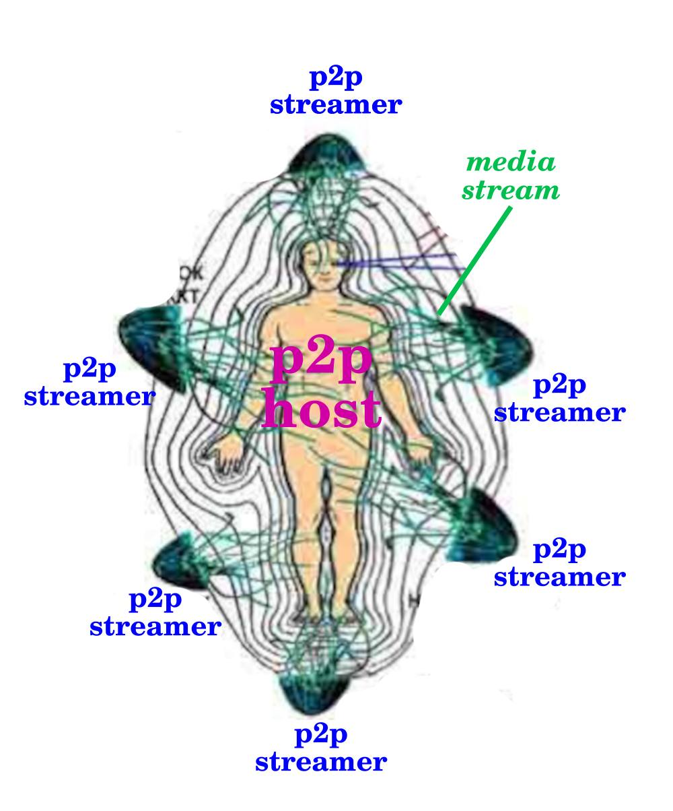

# P2P video streamer

p2p video streamer created with react and peerjs

## host

works as a server endpoint, switches video sources 

## client

streams video from webcam / cam source to an endpoint using webrtc calls

